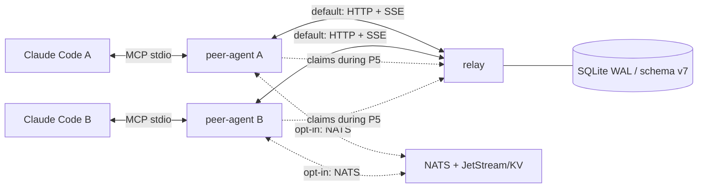

# hangar-bridge

[](./LICENSE)
[](https://nodejs.org)
[](https://pnpm.io)
[](https://www.typescriptlang.org)
[](https://code.claude.com/docs/en/channels-reference)

Claude Code Channels MCP server for cross-host fleet coordination and task dispatch.

`hangar-bridge` lets Claude Code instances in a single-operator fleet message each other,
broadcast coordination updates, dispatch work, relay permission decisions, report presence, and
cooperatively claim shared assets. Inbound messages enter Claude Code through Anthropic's
research-preview `claude/channel` protocol; outbound actions are MCP tools.

> **Status (2026-07-21):** the relay/SSE path is the production-compatible default. The NATS
> P0–P4 substrate is integrated behind opt-in `transport: "nats"` and live-tested locally. P5
> real-fleet cutover/soak and P6 relay deletion remain Board-gated. NATS and SSE cohorts do not
> bridge during mixed mode. See the [cutover runbook](./docs/projects/2026-07-02-relay-to-nats-migration/CUTOVER-RUNBOOK.md).

## Capabilities

- `send_to_peer` — direct chat or `@team` broadcast. A subject-scoped `@team` chat reaches only
  peers that own the namespace and match their interest filter.
- `dispatch_task` — correlated, structured `task_dispatch` delivery. Subjected commands are direct
  messages. The NATS transport advertises and accepts concrete recipients only; it does not claim
  `@team` WorkQueue fanout. A production MCP tool for emitting structured `task_result` is deferred;
  receivers currently report completion with `send_to_peer` chat.
- `list_peers` / `set_summary` — fleet roster plus TTL-backed presence and working context.
- `respond_to_permission` — optional, default-off remote permission verdicts.
- `claim_asset` / `list_claims` / `release_claim` — relay-backed cooperative TTL claims when that
  coordination API is available. The exact schema and compatibility rules are in
  [`docs/CLAIMS.md`](./docs/CLAIMS.md).

The project is a fork of [pouriamrt/claude-mesh](https://github.com/pouriamrt/claude-mesh)
(MIT, base commit `a75d37a`). It keeps the relay/SSE/MCP foundation and security primitives while
replacing the multi-tenant pair-code flow with a single-tenant, operator-managed roster and
per-peer secrets. Attribution is preserved in [`LICENSE`](./LICENSE), [`NOTICE`](./NOTICE), and
`package.json`.

## Architecture

Claude Code always talks to a local peer-agent over MCP stdio. The peer-agent chooses one messaging
transport from its config:



- **SSE (default):** the relay authenticates bearer tokens, stamps `from`, enforces namespace ACLs,
  stores messages/claims in SQLite, and fans messages out over SSE.
- **NATS (opt-in):** NKey permissions establish the sender lane; the peer-agent derives `from` from
  that authenticated lane, enforces the same envelope ACL, uses JetStream for durable tasks, KV for
  completion deduplication, and heartbeats for presence. A durable task is ACKed only after the MCP
  notification succeeds and its permanent completion marker is written. A deterministic inbound
  rejection (for example, a result from the wrong correlated peer) is terminated without consuming
  that correlation marker; KV outages hold the task consumer closed and retry. Core publishes
  complete only after a server `flush`; task publishes
  require a JetStream puback. Failed/disconnected sends are not acknowledged into a volatile
  application outbox.
- **Claims during NATS P5:** messaging can run on NATS while claims continue to use the relay API if
  a valid relay token remains. Claim tools are advertised only after a bounded authenticated
  `GET /v1/claims` succeeds.

There is no peer-to-peer data path. Both supported transports are hub-and-spoke. For the detailed
protocol and trust boundaries, see [`docs/architecture.md`](./docs/architecture.md) and
[`SUBJECT_ROUTING_SPEC.md`](./SUBJECT_ROUTING_SPEC.md).

## Protocol invariants

The shared `EnvelopeSchema` is the single wire-format authority for both transports. It has six
kinds:

```text
chat · presence_update · permission_request · permission_verdict · task_dispatch · task_result
```

Core invariants:

- `from` is transport-authenticated: relay-stamped on SSE, authenticated-lane-derived on NATS.
- `permission_verdict` and `task_result` require `in_reply_to`.
- Replies/acks use `subject = null`.
- A subjected `@team` message is allowed only for `chat`; subjected commands stay direct.
- Subject ownership is fail-closed. Interest patterns narrow delivery but never grant authority.
- Peer content is escaped and treated as untrusted user input before entering Claude's context.

### Disposition convention

Replying to a `task_dispatch` is a conversation, not an acknowledgement: a peer may accept,
decline, counter-propose, or report progress. That answer travels as a **`meta` convention, not a
schema change** — the six envelope kinds are unchanged. A reply SHOULD carry:

- `meta.disposition` ∈ `accepted` | `declined` | `counter_proposal` | `in_progress` | `completed`
- `meta.correlation_id` — copied from the dispatch, so the sender can match the answer

The `send_to_peer` and `dispatch_task` tool descriptions carry this instruction, and each
peer-agent declares a `disposition` capability bit in its presence row. Stalled-correlation
telemetry gates its denominator on that bit: an older binary that declares nothing is excluded
rather than counted as silent. With this in place, the missing-peer signal is **no disposition at
all**, not "no `task_result`".

## Requirements

- Node.js 22 or newer.
- pnpm 10 (`packageManager` currently pins `pnpm@10.32.1`).
- Claude Code 2.1.81 or newer with `claude.ai` authentication and channels enabled.
- `nats-server` v2.14.3 plus `nats` CLI v0.3.1 only for the opt-in NATS path.

## Build and verify

```bash
corepack pnpm install --frozen-lockfile
corepack pnpm audit --prod --audit-level high
corepack pnpm audit --audit-level high
corepack pnpm -r build
corepack pnpm -r typecheck
corepack pnpm -r test:ci
```

Closeout baseline on 2026-07-21: **523 passed, 3 skipped**. Two skips require real Claude drivers;
one optional P4 presence case requires an externally supplied `P4_LIVE_NATS_URL`. The normal gate
still runs the self-provisioned local live-NATS integration suites. Coverage
thresholds are enforced per package: shared 95% lines / 95% functions / 90% branches / 95%
statements; relay 85/85/80/85; peer-agent 80/80/70/80. E2E is integration-only and has no numeric
coverage threshold.

## SSE setup (current default)

The operator owns membership. There is no pair-code or dynamic admin API.

### 1. Initialize each peer

From a built checkout on each host:

```bash
node packages/peer-agent/dist/cli.js init \
  --handle alice \
  --relay http://relay-host:8443
```

This writes:

- `~/.config/hangar-bridge/secret` (mode `0600`)
- `~/.config/hangar-bridge/config.json`
- `~/.config/hangar-bridge/cursor-state.json` (written at runtime; the durable SSE resume cursor)
- an MCP entry named `hangar-bridge-peers` in `~/.claude.json`

It prints the secret's SHA-256 hash. Add that hash to the relay host's
`~/.config/hangar-bridge/peers.json`:

```json
{
  "alice": {
    "secret_sha256_hex": "<64-lowercase-hex>",
    "display_name": "Alice",
    "subjects": {
      "owned": ["hangar"],
      "interest": ["hangar>"]
    }
  }
}
```

Handles must match `^[a-z][a-z0-9_-]{0,31}$`. Ownership entries are exact namespace names;
interest entries are exact subjects or trailing-`>` prefixes.

For multiple projects on one host, use project-scoped identities instead:

```bash
node packages/peer-agent/dist/cli.js init-project \
  --relay http://relay-host:8443 \
  --peers-file ~/.config/hangar-bridge/peers.json
```

See [`docs/PROJECT_ISOLATION.md`](./docs/PROJECT_ISOLATION.md) for collision and `.mcp.json` rules.

#### Registration paths and their MCP config keys

There are three ways to register the peer-agent, and **each writes a different `mcpServers`
key**. The key you pass to `--dangerously-load-development-channels server:<key>` must match the
key that path wrote, or inbound `<channel>` notifications are dropped silently (see §3 below).

| Registration path | Written to | `mcpServers` key | Launch flag |
|---|---|---|---|
| `hangar-bridge init` | `~/.claude.json` | `hangar-bridge-peers` | `server:hangar-bridge-peers` |
| Manual merge of [`packages/operations/claude-config/hangar-bridge.fragment.json`](./packages/operations/claude-config/hangar-bridge.fragment.json) | `~/.claude.json` | `hangar-bridge-peer-agent` | `server:hangar-bridge-peer-agent` |
| `hangar-bridge init-project [<name>]` | `<project>/.mcp.json` | `hangar-bridge-peers-<name>` | `server:hangar-bridge-peers-<name>` |

Note that the key is *not* the server's own `serverInfo` name (`hangar-bridge`), even though the
first path's key happens to look similar.

All three paths plumb `HANGAR_MCP_KEY` into the peer-agent's environment with the key they wrote,
so the startup deaf-check can compare it against the `claude` ancestor process's `server:<key>`
argument and warn when they disagree. The operations fragment is static JSON — if you rename its
`mcpServers` key, **update its `env.HANGAR_MCP_KEY` by hand to match**.

### 2. Start the relay

```bash
export HANGAR_DATA="$HOME/.local/share/hangar-bridge"
export HANGAR_PEERS_FILE="$HOME/.config/hangar-bridge/peers.json"
export HOST=127.0.0.1
export PORT=8443

node packages/relay/dist/index.js init
node packages/relay/dist/index.js
```

Serve also re-seeds the roster at startup, so later secret/ACL changes take effect after updating
`peers.json` and restarting the relay. A user-systemd installer is available at
[`packages/operations/systemd/install-relay.sh`](./packages/operations/systemd/install-relay.sh).
For upgrades, do not improvise from these first-install commands: follow the
[exact-SHA SSE deployment runbook](./docs/DEPLOYMENT.md), which pins source identity, backs up SQLite,
restarts the central relay before peer rollout, and verifies the loaded revision.

Verify:

```bash
curl http://127.0.0.1:8443/health
node packages/peer-agent/dist/cli.js send bob "hello" --relay http://127.0.0.1:8443
```

### 3. Start Claude Code

```bash
claude --dangerously-load-development-channels server:hangar-bridge-peers
```

> **The name after `server:` must match your MCP config key exactly** — the key under
> `mcpServers` in `~/.claude.json` (or `.mcp.json`), NOT the server's own `serverInfo`
> name. A mismatch fails **silently**: the MCP server still connects and every tool
> works, so `/mcp` and `list_peers` both look healthy, but Claude Code drops every
> inbound `<channel>` notification. Outbound keeps working, which makes it read like a
> one-way relay fault rather than a local flag problem.
>
> The only signal is one debug line in the MCP log
> (`~/.cache/claude-cli-nodejs/<project>/mcp-logs-<server>/*.jsonl`):
>
> ```
> Channel notifications skipped: server <name> not in --channels list for this session
> ```
>
> If inbound is silent while outbound works, grep for that line first.

**A silently deaf session has more than one cause, and they look identical from
outside** — inbound entirely gone, everything else healthy, nothing logged as an error.
Check all three before concluding the relay is at fault:

| # | Cause | Check |
|---|---|---|
| 1 | `server:` name ≠ the `mcpServers` key (this repo has three install paths writing three different keys — see the table above) | compare the launch argv against `~/.claude.json` |
| 2 | Several channels passed as `server:a,server:b` or `"server:a server:b"` — Claude does **not** split a flag value, so the whole string is read as one channel name. **Repeat the flag instead**, once per channel | count the `--dangerously-load-development-channels` occurrences in the argv |
| 3 | The server never declared the `claude/channel` capability | `list_peers` → this session's `delivery_state` |

**Replying to an ephemeral message.** A directed `to_filter` chat is delivered live and
never stored — a durable row would be `poll_inbox`-visible to every sibling session on
the recipient handle, which is the opposite of what directed delivery is for. With no
row, `in_reply_to` has no parent to resolve and the relay answers `400 unknown
in_reply_to`. Reply with `meta.correlation_id` instead; the relay mints one alongside the
`ephemeral="1"` flag, and being relay-generated it is authoritative (a sender-supplied
one is stripped as anti-forgery).

This applies **only** to messages carrying `ephemeral="1"`. Everything else keeps a
durable row and `in_reply_to` works normally — do not generalise the workaround, or
ordinary chat loses its thread linkage to fix a narrow case.

> Sessions from before 2026-08-31 hit a stricter version of this: the flag was set but no
> `correlation_id` was minted, so both reply paths were closed and the receiver could only
> open a new, thread-less message. A failure recorded in an older transcript is that bug,
> not a regression of this one.

`delivery_state` on the presence row is the fleet-visible answer for all three: `verified`
means the startup self-check passed, `deaf` means it did not. Never infer a healthy link
from the absence of errors — *this failure mode is defined by having no error to see.*

If you started a session with the wrong key (or no flag at all), you do not lose the conversation:
re-launch with the correct flag plus `--resume <name>` to continue the same session with channel
notifications enabled.

```bash
claude --dangerously-load-development-channels server:hangar-bridge-peers --resume <name>
```

In Claude Code, `/mcp` should show the server connected. `list_peers` is a useful first smoke test.

`poll_inbox` reads the same durable buffer directly — a read-only, cursored peek that never
consumes anything. Use it when a turn was busy enough to miss a pushed `<channel>` tag, and as the
inbound mainline on any harness that does not render server notifications at all.

### Optional Agent Call final-mile

For an already-running local persistent session that is not the peer-agent's Claude Channel host,
the authenticated SSE/NATS transport can hand inbound envelopes to Agent Call instead:

```json
{
  "relay_url": "http://relay-host:8443",
  "token_path": "/absolute/path/to/secret",
  "final_mile": {
    "kind": "agent-call",
    "target": "local-codex",
    "bin": "agent-call"
  }
}
```

`target` must already be registered and exact. The peer-agent executes
`agent-call receive --stdin --json` without a shell and preserves remote `from`, message id, kind,
correlation, and subject as peer data. Agent Call remains the local ingress authority: its receipt
is still only `channel_accepted` or `injected_unverified`, never model observation. Accordingly,
this final-mile mode reports delivery health as `unverified`; it does not reuse Claude Channel's
process probe or turn an Agent Call receipt into a verified model-observation signal.

Because the authenticated remote `from` handle is not a local Agent Call registration, the adapter
sets Agent Call's trusted transport-only `reply: "none"` framing field. The receiving harness is not
shown a bogus local Agent Call reply command. A reply may use only a separately configured Hangar
Bridge outbound surface; if it has none, the reply route is unavailable. It must not try another
local session or start a worker. This mode therefore requires Agent Call newer than commit
`920ce87d8a87b5cfec0eca157d0e15e2623a4430`, which introduced the final-mile acceptance baseline
but did not yet support disabling its generic local reply hint.

This mode has no fallback. A missing binary, offline target, oversized/control-character content,
or refused adapter propagates as a failed local delivery; it never emits the same message through
Claude Channel and never starts another worker. SSE reconnects from the unchanged accepted-delivery
cursor, and JetStream leaves the task unacknowledged for redelivery. Core NATS chat remains
at-most-once by transport contract: the failure is logged as `peer.nats.core_delivery_failed` but
cannot be replayed. Agent Call's 12,288-byte content ceiling applies even though the hangar-bridge
wire format accepts larger envelopes. Permission relay is rejected at config load because a remote
peer cannot approve local permissions. Reverse cross-host replies remain separately configured
hangar-bridge outbound traffic; this adapter is only the destination-host final mile and does not
by itself make a remote round-trip available.

## NATS setup (opt-in, pre-cutover)

Do not flip a production fleet from this README alone. Follow the version-pinned provisioning guide
at [`packages/operations/nats/README.md`](./packages/operations/nats/README.md) and the
[P5/P6 cutover runbook](./docs/projects/2026-07-02-relay-to-nats-migration/CUTOVER-RUNBOOK.md).

The peer config shape is:

```json
{
  "transport": "nats",
  "relay_url": "http://relay-host:8443",
  "token_path": "/home/alice/.config/hangar-bridge/secret",
  "self": "alice",
  "nats": {
    "url": "nats://nats-host:4222",
    "nkey_seed_path": "/home/alice/.config/hangar-bridge/nats/alice.nk",
    "roster_path": "/absolute/path/to/fleet-roster.json"
  }
}
```

Keep `relay_url` and `token_path` during P5 if claim tools must remain available. Without a usable
and reachable relay claim API, NATS messaging still starts, but the three claim tools are not
advertised.

Current NATS compatibility limits are explicit:

- `dispatch_task(to: "@team", ...)` is unavailable; fan out one direct dispatch per chosen peer.
- `permission_relay.routing: "ask_team"` is rejected at config load; use a direct routing policy.
- Only one live NATS peer-agent process per fleet handle is supported. A host-global lock rejects a
  second Claude Code session using the same handle; session-addressed durable routing is deferred.
- NATS `list_peers` preserves roster membership plus heartbeat-derived `online` / `last_seen`, but
  currently returns an empty `summary` and `sessions` list (working-context metadata is not retained).
- App-side NATS ACL denials append to
  `~/.config/hangar-bridge/audit/nats-denials.jsonl` (directory `0700`, file `0600`). A durable
  denied task is not terminally removed unless that audit append succeeds.

## CLI surface

```text
hangar-bridge init --handle <handle> --relay <url> [--force]
hangar-bridge init-project [<name>] --relay <url> [--handle <handle>] [--peers-file <path>] [...]
hangar-bridge send <to> <content> [--relay <url>]
hangar-bridge respond <request_id> allow|deny [--reason "..."] [--relay <url>]
```

The binaries are `hangar-bridge` and `hangar-bridge-peer-agent`; direct `node .../dist/*.js`
invocation is equivalent in a source checkout.

## Packages

```text
packages/shared/       envelope, channel serialization, subjects, constants
packages/relay/        HTTP/SSE relay, SQLite schema v7, claims, presence, ACLs
packages/peer-agent/   MCP server, SSE/NATS transports, tools, correlation, permissions
packages/e2e/          cross-package and live local-NATS integration tests
packages/operations/   relay/NATS config, provisioning, and systemd artifacts
```

## Security and compatibility notes

- Treat the relay or NATS server as a central trust/failure point; use a private overlay or mTLS.
- Never commit raw peer secrets, NKey seeds, tokens, paircodes, or local config directories.
- `claude/channel` is research-preview and may change across Claude Code releases.
- Non-Claude harnesses do not render MCP server notifications; inbound for them is a pull loop.
  kimi additionally gates on **workspace trust** — in a directory that has not been trusted, a
  project-level `mcp.json` is ignored **silently**, so the peer-agent never starts and no error is
  printed. Trust the workspace first, then verify the server is listed before assuming a relay fault.
- SSE and NATS messaging are not bridged. Whole-fleet cutover or intentionally isolated cohorts are
  required until a bridge is implemented.
- The live two-real-Claude outbound permission round-trip remains deferred; unit/integration wiring
  is green and permission relay is default-off.
- The wire schema supports `task_result`, but the production MCP surface does not yet expose a
  structured response tool. Current receiver completion is chat; a correlated response tool and
  its real-Claude smoke remain deferred.
- The relay Docker artifacts use the current `@hangar-bridge/*` workspaces and require both an exact
  `HANGAR_BUILD_REVISION` and an explicit read-only peers roster mount. The systemd path remains the
  production fleet path covered by the [deployment runbook](./docs/DEPLOYMENT.md).

## Contributing

Before pushing:

```bash
corepack pnpm audit --prod --audit-level high
corepack pnpm audit --audit-level high
corepack pnpm -r build
corepack pnpm -r typecheck
corepack pnpm -r test:ci
```

Do not weaken channel escaping, sender authentication, envelope invariants, namespace ACLs, or test
thresholds to make a change pass. Security issues should not be filed publicly.

## License

[MIT](./LICENSE) © 2026 Pouria Mortezaagha; fork maintained by cookys.
